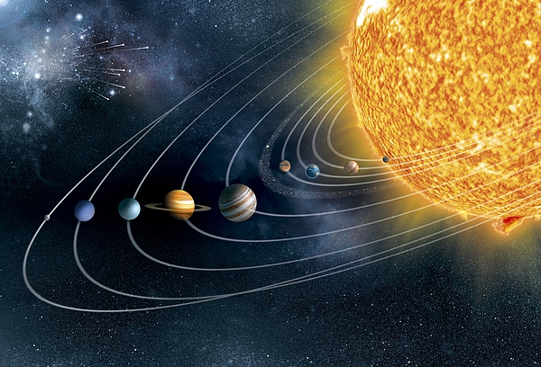

# NPM Solar System

<p align="center">
  
</p>
 
NPM SolarSystem 

From this npm package, you can retrieve information about our solar system. Everything related to our solar system from the 8 planets, sun, pluto, etc. More content will be added in future versions. Important note: All image and details are from Nasa.gov. 

# Install
```
npm install npm-solar-system
```

# Usage
```
const planets = require('npm-solarsystem')

let mercury = planets.getMercury();
```

# API

## language  ## 
Type: ```object```

**.getMercury**  
Get information about mercury.

**.getVenus()**   
Get information about venus.

**.getEarth()**   
Get information about earth.

**.getMars()**   
Get information about mars.

**.getJupiter()**   
Get information about jupiter.

**.getSaturn()**   
Get information about saturn.

**.getUranus()**   
Get information about uranus.

**.getNeptune()**   
Get information about Neptune.

**.getPluto()**   
Get information about venus.

**.getSun()**   
Get information about sun.

**.getMeteorite()**   
Get information about meteorites.

**.getComets()**   
Get information about comets.

**.getAsteroids()**   
Get information about asteroids

# Return Example
Note: Example format is same for any calls in the API section below:

## Plants (Including Pluto)
``` 
{
    image: // image link to the planet
    distanceFromSun: // distance between planet and sun in miles
    yearLength: // 1 year on the planet in Earth days
    description: // information about planet
    radius: // radius of planet
    websiteLink: // link to nasa website about the planet
    oneEarthDay: // 1 Earth day at the planet 
    moons: // number of moons of a planet
}
```

## Sun

```
{
    image: // link to Sun image
    description: // info about the sun
    websiteLink: // link to Nasa website about the Sun
}
```

## Meteorite

```
{
    meteors: // definition about meteors
    meteorShowers: // definition about meteor showers
    meteorShowerLink: // link to Nasa website about meteor showers
    image: // image link to meteor showers
}
```

## Comets & Asteroids

```
{
    def: // main definition from Nasa website
    image: // image link
    link: // link to Nasa website 
}
```

# Final Notes

This package will be regularly updated.     
Thank you for using. 